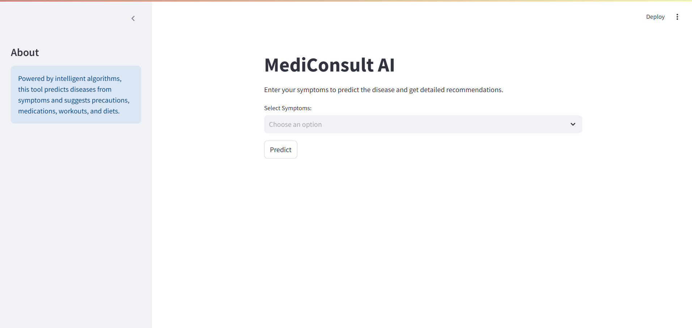

# 💊Personalized Medicine Recommending System🩺

## Description

A Medicine Recommendation System is a Machine Learning model that can assist healthcare professionals in prescribing the right medication to patients based on their medical conditions, symptoms, allergies, and other relevant factors. It can help healthcare professionals in prescribing the right medication to their patients, reducing the risk of adverse effects and improving patient outcomes.

- ``Data Collection:`` Collect data on medications, medical conditions, symptoms, and allergies from various sources like medical journals, electronic health records, clinical trials, etc. Organize the data into a structured format that can be easily processed by the system.

- ``Data Pre-processing:`` Clean the data, remove duplicates, and perform data transformations like normalization, encoding, etc. Convert the data into a format suitable for machine learning algorithms.

- ``Feature Extraction:`` Extract relevant features from the data that can help the system in identifying the right medication for a patient. For example, medical conditions, symptoms, age, gender, weight, allergies, previous medical history, etc.

- ``Machine Learning Model Selection:`` Choose a suitable machine learning algorithm that can learn from the data and recommend the right medication. Popular algorithms include decision trees, random forests, support vector machines, and neural networks.

- ``Training the Model:`` Train the machine learning model on the pre-processed data. Evaluate the performance of the model using appropriate metrics like accuracy, precision, recall, and F1-score. Fine-tune the model by adjusting its hyperparameters to improve its performance.

## Project Overview
The project files are organized into the following directories:

### 1. kaggle_dataset
- `description.csv`: Descriptions of diseases.
- `diets.csv`: Recommended diets for diseases.
- `medications.csv`: Medications prescribed for diseases.
- `precautions_df.csv`: Precautions to be taken for diseases.
- `Symptom-severity.csv`: Severity of symptoms.
- `symptoms_df.csv`: Symptoms with corresponding disease labels.
- `Training.csv`: Dataset for training machine learning models.
- `workout_df.csv`: Recommended workouts for diseases.

### 2. model
- `svc.pkl`: Trained Support Vector Classification model for disease prediction.

### 3. screenshots
</img>


## How to Run the Project
To run the Disease Prediction and Medical Recommendation System:

1. **Install required Python libraries:**
   ```bash
   pip install pandas scikit-learn streamlit ast numpy fuzzywuzzy pickle

2. **Navigate to the project directory:**
   ```bash
   cd ML_project

3. **Start the Flask application:**
   ```bash
   python app.py

4. **Access the web interface in your browser at:**
   ```bash
   http://localhost:5000

